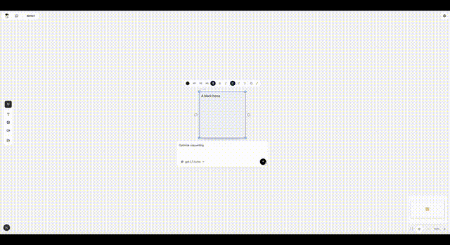
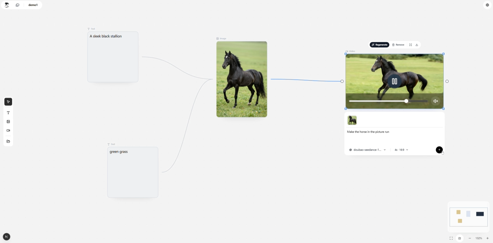

# Muses Canvas

<p align="center">
  <a href="./README.md">English</a> |
  简体中文 |
  <a href="./README.zh-TW.md">繁體中文</a> |
  <a href="./README.ja.md">日本語</a> |
  <a href="./README.ko.md">한국어</a>
</p>

<p align="center">
  
</p>

<p align="center">
  <strong>A standalone AI creation workspace for generating images and videos on an infinite canvas.</strong>
</p>

<p align="center">
  
</p>

<p align="center">
  
</p>

## 项目简介

Muses Canvas 是一个围绕无限画布打造的独立 AI 创作工作区。它把文本、图片、视频生成放进同一个可视化空间里，让提示词、参考素材、生成结果和后续迭代始终保持在同一条创作链路中。

这个项目采用本地优先设计，强调独立可运行。核心画布流程无需登录，也不依赖托管后端，项目数据和媒体文件都会直接保存在本地磁盘中。

## 项目亮点

- 面向 AI 图片与视频创作的无限画布工作流
- 文本、图片、视频节点可在同一工作区中连接协作
- 本地优先，无需登录即可体验核心功能
- 参考图、提示词链路、生成结果都能留在同一张图中管理
- 代码结构更适合开源协作、二次开发和扩展

## 快速开始

```bash
npm install
npm run dev
```

打开 `http://localhost:3000`。

## 构建

```bash
npm run build
npm start
```

## 校验

```bash
npm run lint
npx tsc --noEmit
```

## 本地存储

- 画布图数据：`data/projects/*.json`
- 导入与生成的媒体文件：`data/media/*`
- 资产库索引：`data/library.json`

## 项目结构

- `app/`：Next.js App Router 页面与 API 路由
- `components/canvas/`：画布相关 UI
- `components/canvas/workspace/`：Flow 画布、节点渲染、工具栏与工作区外壳
- `lib/canvas/`：共享的画布 API 与工作区领域逻辑
- `lib/provider/`：模型提供方设置与浏览器侧辅助逻辑
- `lib/server/`：本地持久化、模型执行与媒体存储
- `store/`：轻量级 Zustand 状态管理

## 运行流程

1. 页面层负责渲染工作区，并把状态变更委托给共享客户端 API。
2. API 路由尽量保持轻量，并把实际工作交给共享服务模块。
3. 服务端模块会在 `data/` 目录下读写本地 JSON 和媒体文件。
4. 模型返回结果会先被统一整理，再更新到前端图结构中。

## 说明

- 当前仓库专注于独立可运行的画布创作体验。
- 项目数据和媒体文件默认保存在本地，而不是依赖托管后端。
- 代码结构已经按职责拆分，后续做定制化和扩展会更容易。
