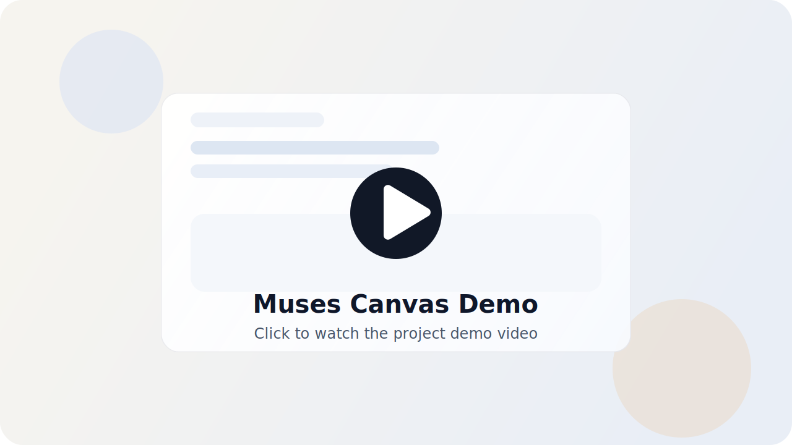

# Muses Canvas

<p align="center">
  <a href="./README.md">English</a> |
  <a href="./README.zh-CN.md">简体中文</a> |
  繁體中文 |
  <a href="./README.ja.md">日本語</a> |
  <a href="./README.ko.md">한국어</a>
</p>

<p align="center">
  
</p>

<p align="center">
  <strong>A standalone AI creation workspace for generating images and videos on an infinite canvas.</strong>
</p>

<p align="center">
  <a href="./public/demo.mp4">
    
  </a>
</p>

## 專案簡介

Muses Canvas 是一個以無限畫布為核心的獨立 AI 創作工作區。它把文字、圖片、影片生成放進同一個視覺化空間，讓提示詞、參考素材、生成結果與後續迭代始終維持在同一條創作脈絡中。

這個專案採用本地優先設計，強調獨立可運行。核心畫布流程無需登入，也不依賴託管後端，專案資料與媒體檔案都會直接儲存在本機磁碟中。

## 專案亮點

- 面向 AI 圖片與影片創作的無限畫布工作流
- 文字、圖片、影片節點可在同一工作區中串接協作
- 本地優先，無需登入即可使用核心功能
- 參考圖、提示詞鏈路、生成結果都能留在同一張圖中管理
- 程式碼結構更適合開源協作、二次開發與擴充

## 快速開始

```bash
npm install
npm run dev
```

開啟 `http://localhost:3000`。

## 建置

```bash
npm run build
npm start
```

## 驗證

```bash
npm run lint
npx tsc --noEmit
```

## 本地儲存

- 畫布圖資料：`data/projects/*.json`
- 匯入與生成的媒體檔案：`data/media/*`
- 資產庫索引：`data/library.json`

## 專案結構

- `app/`：Next.js App Router 頁面與 API 路由
- `components/canvas/`：畫布相關 UI
- `components/canvas/workspace/`：Flow 畫布、節點渲染、工具列與工作區外框
- `lib/canvas/`：共享的畫布 API 與工作區領域邏輯
- `lib/provider/`：模型供應商設定與瀏覽器端輔助邏輯
- `lib/server/`：本地持久化、模型執行與媒體儲存
- `store/`：輕量級 Zustand 狀態管理

## 執行流程

1. 頁面層負責渲染工作區，並將狀態變更委派給共享的客戶端 API。
2. API 路由盡量維持精簡，並把實際工作交給共享服務模組。
3. 伺服器端模組會在 `data/` 目錄下讀寫本地 JSON 與媒體檔案。
4. 模型回傳結果會先經過統一整理，再更新到前端圖結構中。

## 說明

- 目前此倉庫聚焦於可獨立運行的畫布創作體驗。
- 專案資料與媒體檔案預設儲存在本機，而不是依賴託管後端。
- 程式碼已依職責拆分，後續要做客製化與擴充會更容易。
